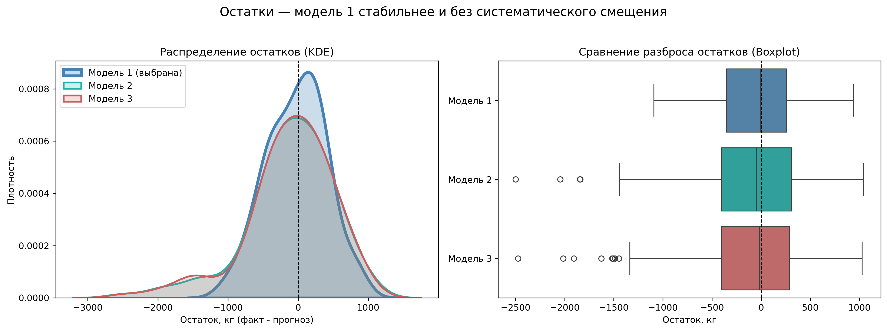
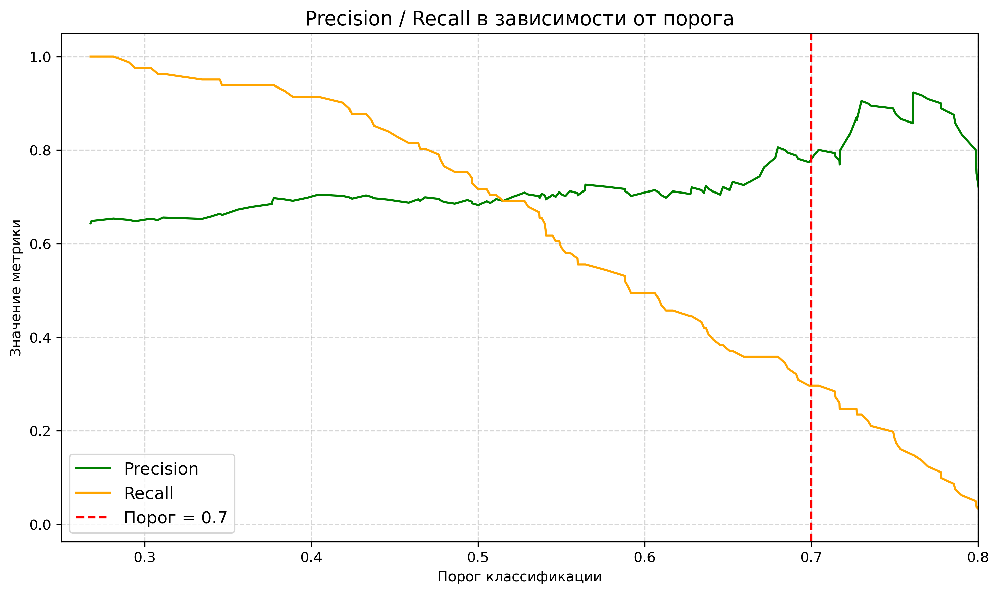

# 🐄 Прогнозирование удоя и вкуса молока

ML-проект: помогаем фермеру отобрать коров для покупки. Две задачи — **регрессия** (прогноз годового удоя, кг) и **классификация** (будет ли молоко вкусным).

**Результат: из 20 коров-кандидатов отобраны 5, удовлетворяющие обоим критериям заказчика** (удой > 6000 кг, вероятность вкусного молока ≥ 0.7 при precision модели 0.80).


## 📋 Задача

Фермер расширяет молочное стадо и очень тщательно отбирает коров: каждая должна давать не менее 6000 кг молока в год, а молоко — соответствовать его строгим критериям вкуса. По данным о текущем стаде нужно построить две модели и применить их к списку коров, предлагаемых к покупке.

## 📊 Данные

- `ferma_main.csv` — характеристики коров текущего стада (удой, рацион, порода, вкус молока)
- `ferma_dad.csv` — данные о быках-отцах
- `cow_buy.csv` — 20 коров-кандидатов на покупку (без данных о корме — по условию задачи рацион будет улучшен, признаки кормления скорректированы на +5%)

Выполнены: предобработка (дубликаты, пропуски, опечатки в категориях), разведочный и корреляционный анализ, кодирование категориальных признаков (OHE), масштабирование.

## 🧪 Регрессия: прогноз удоя

Проверены три версии линейной регрессии с разным набором признаков:

| Модель | Особенности признаков | R² (test) | MAE, кг | RMSE, кг |
| --- | --- | --- | --- | --- |
| **1 — базовая** | `spo_ratio` как количественный признак | **0.39** | **346** | **424** |
| 2 — feature engineering | бинаризация `spo_ratio`, квадрат кормовой единицы | –0.36 | 461 | 631 |
| 3 — модель 2 + родословная | добавлен `father_name` | –0.36 | 458 | 631 |

**Ключевой вывод:** усложнение не помогло. Бинаризация информативного количественного признака и высокоразмерная категория (`father_name`) ухудшили обобщающую способность — модели 2 и 3 предсказывают хуже среднего (отрицательный R²). Анализ остатков модели 1 показывает симметричное распределение с меньшей дисперсией; у моделей 2–3 — систематическое завышение и выраженная нелинейность ошибок.



## 🧠 Классификация: вкус молока

Логистическая регрессия. Выбор метрики обоснован бизнес-логикой: ошибка первого рода (модель обещает вкусное молоко, а оно невкусное) означает покупку неподходящей коровы — прямые потери фермера. Ошибка второго рода — лишь упущенная возможность. Поэтому приоритет — **precision**.

Под эту логику **подобран порог классификации**:

| Порог | Precision | Recall |
| --- | --- | --- |
| 0.5 (по умолчанию) | 0.68 | 0.72 |
| **0.7 (выбран)** | **0.80** | 0.30 |

Сознательный компромисс: модель рекомендует меньше коров, но её рекомендациям можно доверять — именно это нужно заказчику при дорогой цене ошибки.


 


## ✅ Итог для заказчика

Модели применены к 20 коровам-кандидатам: **5 коров** прошли оба критерия (прогноз удоя > 6000 кг и вероятность вкусного молока ≥ 0.7). Все пять — одной породы, что само по себе полезный сигнал для дальнейшей селекции. Рекомендация: купить отобранных коров, остальных — проверять дополнительно.

## 🛠 Стек

`Python` · `pandas` · `NumPy` · `scikit-learn` · `Matplotlib` · `Seaborn` · `Jupyter`

## 🚀 Как запустить

```bash
git clone https://github.com/foxypandas/cow-milk-ml-analysis.git
cd cow-milk-ml-analysis
pip install -r requirements.txt
jupyter notebook notebooks/cow-milk-ml-analysis.ipynb
```

## 📁 Структура проекта

```
├── data/          # исходные датасеты
├── notebooks/     # основной ноутбук с анализом
├── images/        # графики и визуализации
└── requirements.txt
```

## 💡 Направления развития

- Нелинейные модели (градиентный бустинг, случайный лес) — анализ остатков указывает на нелинейные зависимости
- Кросс-валидация вместо одного train/test-разбиения
- Больше данных о вкусе молока — текущая выборка ограничивает качество классификации
